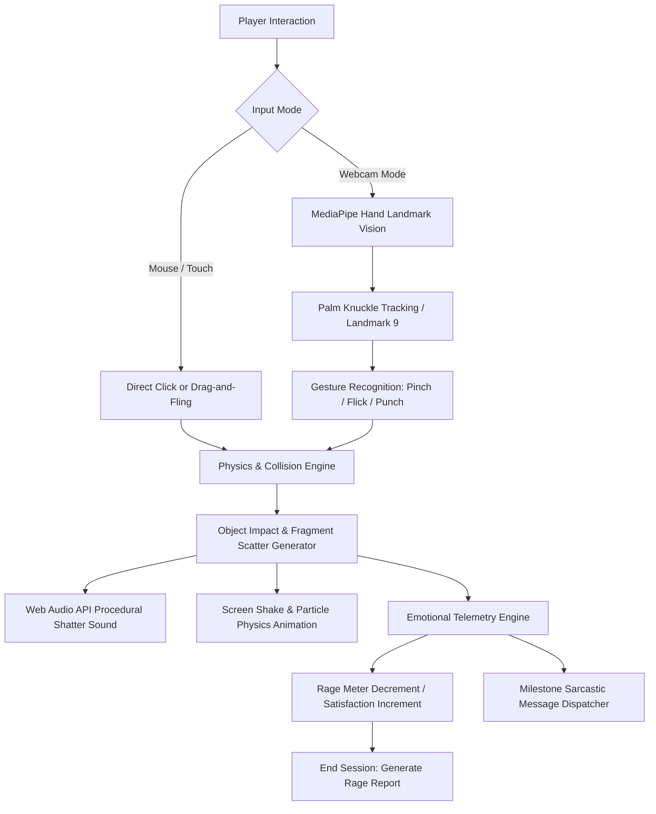

# Rage Report 🎯

A virtual rage room and decompression therapy sandbox where you violently demolish infinite glassware using rocks, hammers, rods, or AI webcam hand tracking — complete with procedural glass-shattering acoustics and sarcastic psychological evaluations.

## Basic Details
### Team Name: Yoohoho!

### Team Members
- Team Lead: AMAL SANKAR - SNM INSTITUTE OF MANAGEMENT AND TECHNOLOGY MALIYANKARA
- Member 2: AADYA IH - SNM INSTITUTE OF MANAGEMENT AND TECHNOLOGY MALIYANKARA

### Project Description
Glass Rage is a browser-based virtual demolition room designed for high-stress humans who want the visceral thrill of smashing bottles, mirrors, and windows without paying for damages, wearing safety goggles, or sweeping up glass shards for weeks. Players interact using drag-and-fling mouse controls or hands-free computer vision gestures powered by Google MediaPipe AI.

### The Problem (that doesn't exist)
Modern life is full of minor annoyances: 30-second unskippable YouTube ads, merge conflicts at 2 AM, printers printing blank pages with low cyan errors, and people saying "per my last email". 

However, taking out your aggression on household glassware in real life comes with devastating downsides:
- Porcelain and glass are shockingly expensive to replace.
- Broken shards mysteriously linger in floor crevices and impale your socks three weeks later.
- Your landlord and neighbors tend to call emergency services when you throw a wine bottle into the drywall.

### The Solution (that nobody asked for)
**Glass Rage: Zero Mess. Zero Regrets. Maximum Dopamine.**
- An endless supply of procedural bottles, drinking glasses, jars, vases, mirrors, and windows waiting to be demolished.
- **Weapon Arsenal**: Swap between heavy **Rocks**, crushing **Hammers**, and piercing steel **Rods**.
- **AI Hand Tracking**: Wave your hands in mid-air like an enraged sorcerer! Using MediaPipe AI vision via your webcam, flick, punch, or pinch to launch projectiles across your screen.
- **Procedural Audio Synthesizer**: Custom Web Audio API frequency clacks and white noise filters that replicate authentic glass-shattering acoustics without external audio files.
- **Rage vs. Satisfaction Meters & Troll Commentary**: Monitors emotional decompression in real time, serving unscientific "Rage Reports" that roast your anger issues.

---

## Technical Details

### Technologies/Components Used

#### For Software:
- **Languages used**: JavaScript (ES6+), HTML5, CSS3
- **Frameworks used**: Vanilla Web Platform (zero build step, zero dependencies, ultra-fast 60 FPS performance)
- **Libraries used**:
  - `@mediapipe/hands` (v0.4.1675469240 - Lite model for low-latency palm & finger landmark tracking)
  - `@mediapipe/camera_utils` (Video stream handling and frame pipeline)
  - `@mediapipe/drawing_utils` (Real-time PIP HUD hand skeleton overlay)
  - **Web Audio API** (Procedural oscillator and highpass-filtered white noise buffer synthesis)
- **Tools used**: Visual Studio Code, Antigravity IDE, Python 3 (local development HTTP server), Git & GitHub

#### For Hardware:
- *Not applicable — Pure Software application using standard consumer webcams/microphones.*

---

### Implementation

#### For Software:

# Installation
```bash
# Clone the repository
git clone https://github.com/aadyaih2026-tech/Rage-Report.git

# Navigate into the project directory
cd Rage-Report
```

# Run
**Option 1: Quick Launch (Windows)**
- Simply double-click the included `start-server.bat` file in the project folder. It will start the local server and automatically open the game in your default browser.

**Option 2: Terminal / Any OS**
```bash
# Start a local HTTP server (required for browser webcam/MediaPipe permissions)
python -m http.server 8080
```
Open your browser and navigate to:
```
http://localhost:8080
```

---

### Project Documentation

#### For Software:

# Screenshots (Add at least 3)

![Screenshot1]https://drive.google.com/drive/folders/1-W4IhmyJ-lL8xzZBpq9LiaGoprUcW4WV
*The active Smash Arena displaying kinetic glass shard explosions, weapon selector, and real-time Rage vs Satisfaction meters.*

![Screenshot2]https://drive.google.com/drive/folders/1-W4IhmyJ-lL8xzZBpq9LiaGoprUcW4WV
*Live Picture-in-Picture (PIP) Camera HUD showing MediaPipe 21-point hand skeleton tracking, reticle cursor, and pinch/flick throw detection.*

![Screenshot3]https://drive.google.com/drive/folders/1-W4IhmyJ-lL8xzZBpq9LiaGoprUcW4WV
*Post-game Rage Report analyzing total destroyed pieces and serving sarcastic psychological commentary.*

# Diagrams

### Workflow Architecture

*System architecture showing the dual input pipeline (Mouse vs MediaPipe AI), particle physics simulator, procedural audio synthesis, and psychological telemetry feedback loop.*

#### For Hardware:
*(Not applicable for this software project)*

---

### Project Demo

# Video
https://drive.google.com/drive/folders/1-W4IhmyJ-lL8xzZBpq9LiaGoprUcW4WV
*Demonstration of mouse drag-and-throw mechanics, AI webcam hand tracking gestures, glass shattering physics, and results analysis.*

# Additional Demos
- Interactive Test-Bottle on the Home screen to preview shattering physics directly.
- Weapon switching: Rock (heavy clack), Hammer (crushing blow), Rod (piercing strike).
- Live Picture-in-Picture camera feed with real-time glowing skeleton landmarks.

---

## Team Contributions
- **Amal Sankar**: Core game loop architecture, object spawning mechanics, particle collision physics, and project coordination.
- **Aadya IH**: Google MediaPipe AI hand tracking integration, real-time PIP Camera HUD, gesture velocity recognition (pinch/flick/punch).
Procedural Web Audio synthesizer (glass impact acoustics), UI/UX glassmorphic design system, and Home intro page experience.

---
Made with ❤️ at TinkerHub Useless Projects 


